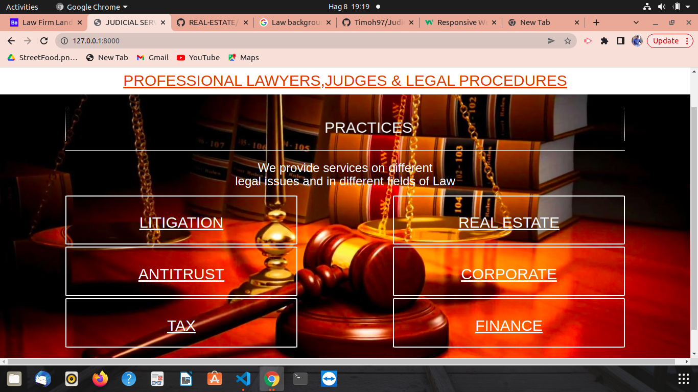
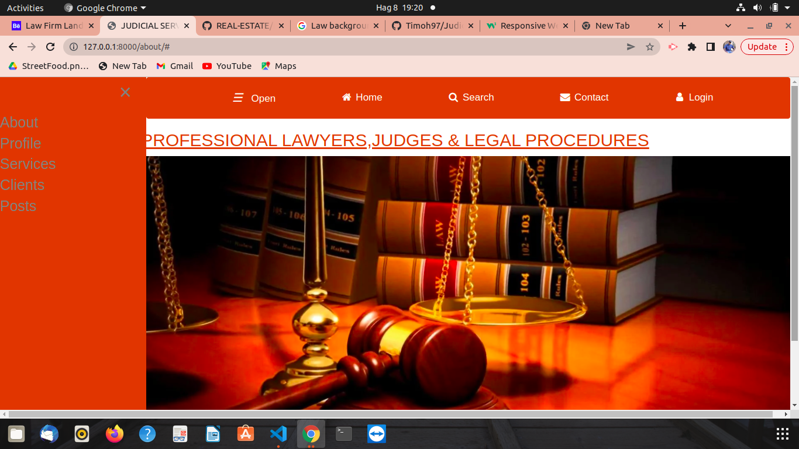
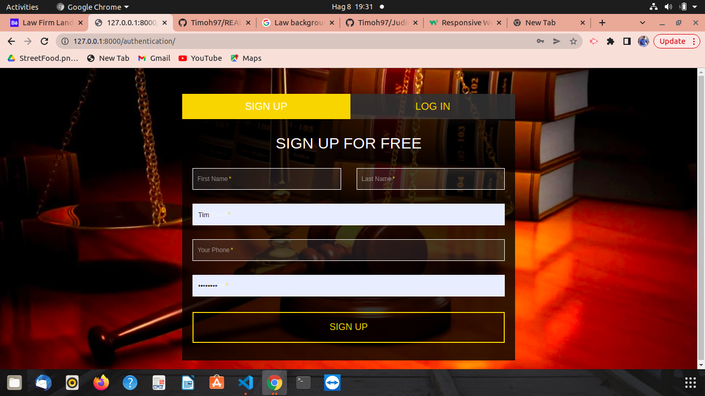
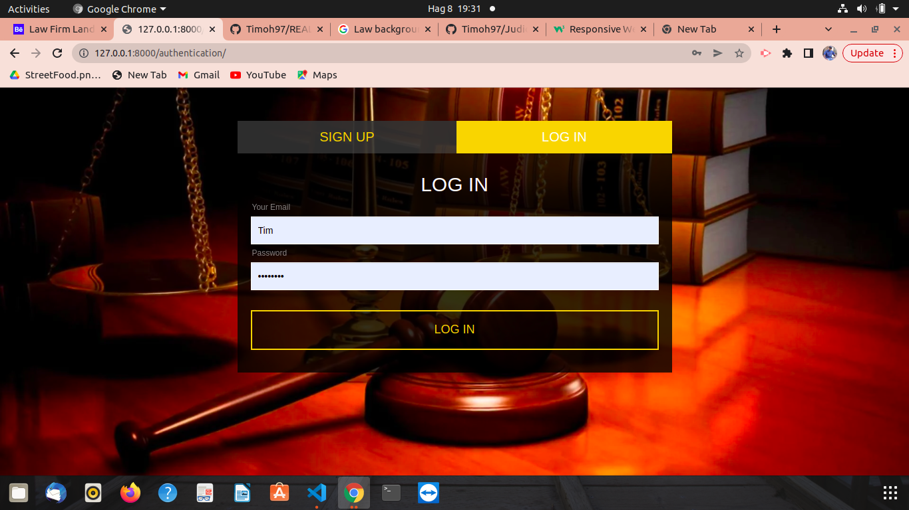

# Judicial service

## Author 
Built by: [Timothy Mugendi](https://github.com/Timoh97)

# Description


#### Prerequisites 
* python3.8
* pip
* Django

## User Story
* Sign in to the application to start using.
* See your profile.
* Search for different users using their usernames.
* Message other professionals.
* View posts from staff members,post, update profile, see services offered.
* Check our clients,their testimonials and our contacts pages.

## Behaviour Driven Development
| Behaviour | Input | Output |
| :---------------- | :---------------: | ------------------: |
| Load the application | On application load | Display of Login Form |
| Create account by Sign Up | Enter email, username and password| Redirect to login|
| Login selected | Enter username and password you signed up with| Redirect to home page|
| Post remark/complaint button selected | Post | Input details in a form and upload |
| Click the other buttons on navbar | CLick | Redirected to page wih all the comments made on the post |
| Click the user profile icon | Select Profile | Redirected to profile page where you can edit profile |
| Click the user profile icon | Select Logout | Logout and redirected to login page |

# Setup and Installation
#### Cloning the repository
* Open Terminal:
```bash
        $ 
        $ cd judicial service
        $ code . or atom . based on your text editor 
```
* Navigate into the folder, install and activate virtual environment
```bash
      $ python -m venv virtual

      $ source virtual/bin/acivate
```
* Install all dependencies in requirements.txt
```bash
      $ pip install -r requirements.txt
```
#### Setup the Database
* Setup the database username, password, host then make migrations  
```bash
      $ 
 
```
* Run migrations
```bash
      $ python manage.py makemigrations application
```
```bash
      $ python manage.py migrate application
      
      (each time the database models change repeat the migrate and upgrade commands.)
```
### Running the Application
* To run the application, open the cloned repo in terminal and run the following commands:
```bash
      $ python3 manage.py runserver
```
### Testing the Application       
* To run unittests for the class application and check if it functions well:
```bash
      $ python3 manage.py test ---
```
## Known Bugs
* No known bugs so far, incase a bug is spotted pull requests are allowed.


## Technologies Used
* markdown

* Django_Bootstrap4 - for bootstrap version 4

* Heroku - online deployment


## Support and contact details
Incase of any issues at hand, please email me at timohmugendi@gmail.com or call me via +254791417147
## Preview of the web pages
 

  

  

  

### License
<a href='https://github.com/Timoh97/Judicial-Service/blob/master/LICENSE'>MIT LICENSE</a>
 [**TIMOTHY MUGENDI**]